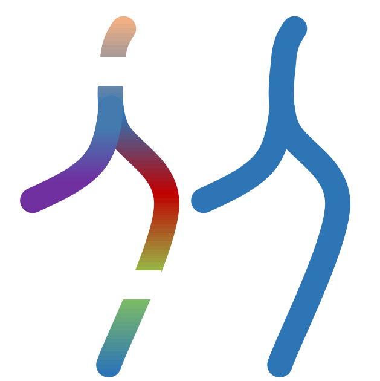
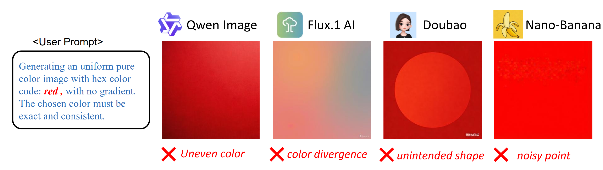
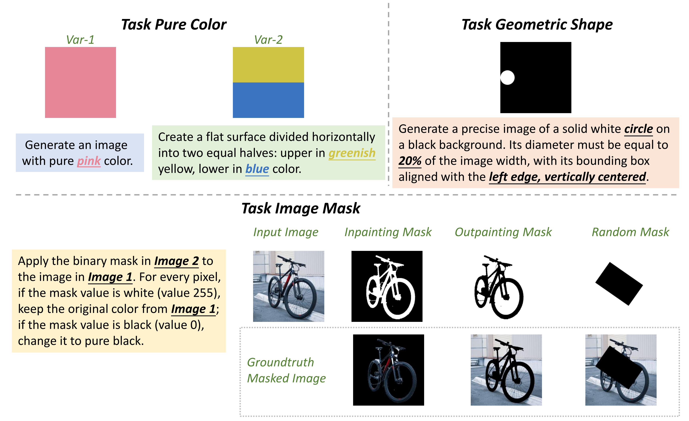
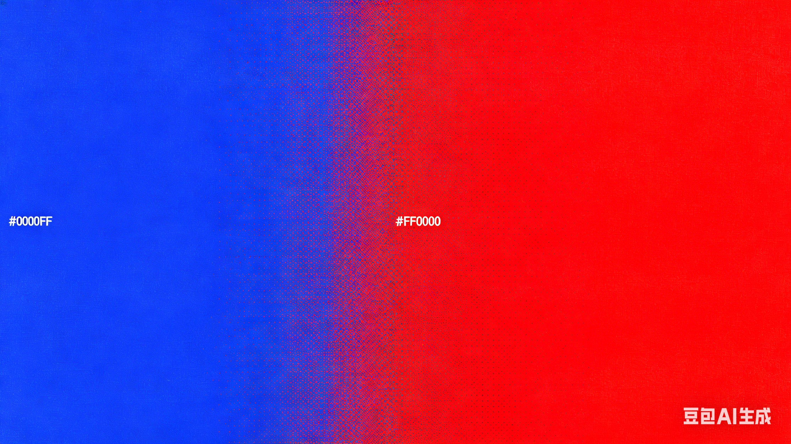
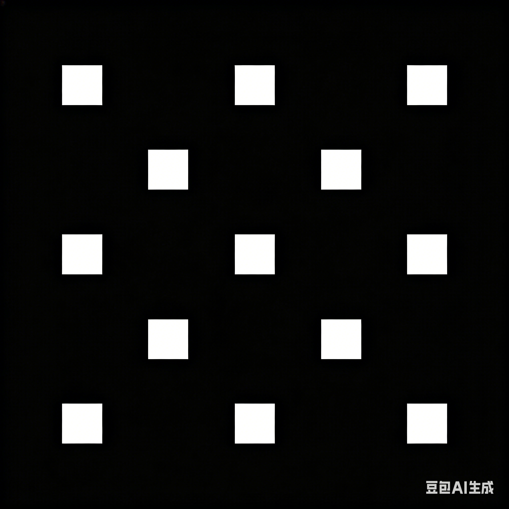

<h1>
  
  Violin: Exploring the AI Obedience: Why is Generating a Pure Color Image Harder than CyberPunk?
</h1>


<p align="center">
    <a href="https://arxiv.org/abs/2603.00166"></a>
    <a href="https://ai-obedience.github.io/"></a>
    <a href="https://huggingface.co/datasets/Perkzi/VIOLIN"></a>
</p>

## 🔥 News
* **2026.5.12:** The Violin dataset and Project Page bas been released.
* **2026.5.11:** The paper has been released.





## 🎨 Introduction
Generative AI excels at complexity but faces a "Paradox of Simplicity": models often fail at low-entropy tasks like generating pure color images. We attribute this to "aesthetic bias," where emergent scaling priors override deterministic simplicity, hindering the transition to true abstraction.
We formalize AI Obedience (Levels 1–5) and introduce Violin, the first benchmark for Level 4 Obedience, testing color purity, masking, and geometric shapes.

**Violin Benchmark** comprises three tasks:




## 🤗 Dataset Download

Please run the following commands to download the dataset:

```python
# prepare
pip install -r requirements/requirement_general.txt

# download from anonymous huggingface
git clone https://huggingface.co/datasets/Perkzi/VIOLIN

# change parquet data to real images, this takes a few minutes.
python parquet_to_violin_data.py

# rename
mv Violin benchmark
```

## 🚀 Generate and Evaluate with Open-Source Models
### Installation
```bash
conda create -n violin_opensource python=3.10
conda activate violin_opensource
pip install -r requirements/requirement_opensource.txt
```
### Running the Benchmark
**Basic Usage:**
```bash
# Text-to-Image Generation
python eval_open_source/generate/generate_opensource_models.py \
    --model_name "Qwen/Qwen-Image" \
    --prompt "a pure red image" \
    --output_image "output.png"

# Image Editing (for Qwen-Image-Edit models)
python eval_open_source/generate/generate_opensource_models.py \
    --model_name "Qwen/Qwen-Image-Edit-2511" \
    --input_images "image1.png" "image2.png" \
    --prompt "replace the object with a tree" \
    --output_image "edited.png"
```

**Supported Models:**
- FLUX.1 (`black-forest-labs/FLUX.1-schnell`, `black-forest-labs/FLUX.1-dev`)
- FLUX.2 (`black-forest-labs/FLUX.2-klein-4B`, `black-forest-labs/FLUX.2-dev`)
- Z-Image (`Tongyi-MAI/Z-Image`, `Tongyi-MAI/Z-Image-Turbo`)
- Qwen-Image (`Qwen/Qwen-Image`, `Qwen/Qwen-Image-Edit-2511`)

**Key Arguments:**
- `--model_name`: Model path on HuggingFace (required)
- `--input_images`: Input images for editing (optional, space-separated)
- `--width`, `--height`: Image size (default: 1024×1024)
- `--num_inference_steps`: Steps (default: 20)
- `--seed`: Random seed (default: 655)

### Running the Benchmark
Once images are generated, evaluate them using our VIOLIN metrics:
```bash
# Evaluate Color Purity (Variation 1 - Single Block)
python eval_open_source/evaluate/evaluate_open_source_models.py \
    image1.png image2.png \
    --type color

# Evaluate Color Purity (Variation 2 - Dual Block)
python eval_open_source/evaluate/evaluate_open_source_models.py \
    gen_image.png gt_image.png \
    --type color --multi

# Evaluate Image Mask Task
python eval_open_source/evaluate/evaluate_open_source_models.py \
    generated_mask.png ground_truth_mask.png \
    --type mask

# Evaluate Geometric Shape Task
python eval_open_source/evaluate/evaluate_open_source_models.py \
    generated_shape.png ground_truth_shape.png \
    --type shape
```


## 📊 Obedience Evaluation Results

### Comparison of Level-4 Obedience on Pure Color Generation Task

| Type | Models | rgb-ed | lab-00 | sd | ced | hf | **color-mean** |
| :--- | :--- | :---: | :---: | :---: | :---: | :---: | :---: |
| **Open-Source** | FLUX.1 | 0.206 | 0.167 | 0.064 | 0.006 | 0.016 | **0.091** |
| | FLUX.2 | 0.123 | 0.091 | 0.044 | 0.007 | 0.021 | **0.057** |
| | Z-Image | 0.135 | 0.092 | 0.078 | 0.002 | 0.007 | **0.061** |
| | Qwen-Image | 0.122 | 0.084 | 0.047 | 0.002 | 0.017 | **0.057** |
| **Closed-Source** | Nano-Banana-2 | 0.126 | 0.093 | 0.033 | 0.001 | 0.010 | **0.053** |
| | Seedream-5 | 0.134 | 0.093 | 0.015 | 0.001 | 0.001 | **0.049** |
| | GPT-Image-2 | 0.137 | 0.083 | 0.006 | 0.000 | 0.031 | **0.051** |

### Comparison of Level-4 Obedience on Geometric Shape Generation Task
| Type | Models | iou | size | shape | purity | dist | **mask-mean** |
| :--- | :--- | :---: | :---: | :---: | :---: | :---: | :---: |
| **Open-Source** | FLUX.1 | 0.725 | 0.703 | 0.167 | 0.172 | 0.267 | **0.407** |
| | FLUX.2 | 0.607 | 0.659 | 0.004 | 0.127 | 0.122 | **0.304** |
| | Z-Image | 0.648 | 0.686 | 0.002 | 0.133 | 0.409 | **0.376** |
| | Qwen-Image | 0.645 | 0.630 | 0.001 | 0.283 | 0.128 | **0.337** |
| **Closed-Source** | Nano-Banana-2 | 0.566 | 0.597 | 0.046 | 0.105 | 0.097 | **0.282** |
| | Seedream-5 | 0.551 | 0.376 | 0.006 | 0.035 | 0.070 | **0.207** |
| | GPT-Image-2 | 0.317 | 0.278 | 0.003 | 0.038 | 0.033 | **0.134** |

### Comparison of Level-4 Obedience on Image Mask Task

| Type | Models | iou | biou | leak | edge | dist | **shape-mean** |
| :--- | :--- | :---: | :---: | :---: | :---: | :---: | :---: |
| **Open-Source** | FLUX.2 | 0.848 | 0.948 | 0.438 | 0.131 | 0.197 | **0.512** |
| **Closed-Source** | Nano-Banana-2 | 0.474 | 0.772 | 0.286 | 0.172 | 0.127 | **0.366** |
| | Seedream-5 | 0.331 | 0.725 | 0.177 | 0.073 | 0.093 | **0.280** |
| | GPT-Image-2 | 0.096 | 0.398 | 0.087 | 0.186 | 0.023 | **0.158** |


## Other Obedience Tasks

To evaluate the deterministic control of generative models beyond basic scenes, we extend to three mathematically constrained tasks. These experiments highlight the "Paradox of Simplicity" in SOTA models like Seedream-5.0.

| Task 1: Area Ratio Control | Task 2: Pixel-level Border Alignment | Task 3: Discrete Point Counting |
| :---: | :---: | :---: |
|  |  |  |
| **Requirement**: Exactly 13% Blue (#0000FF) and 87% Red (#FF0000). | **Requirement**: A 1024x1024 canvas with a precise 20-pixel-wide white border. | **Requirement**: Exactly 10 white dots, each being a 4x4 pixel square. |
| **Failure**: Defaulting to 50/50 symmetry or adding forbidden gradients. | **Failure**: Inconsistent border thickness or "aesthetic" glowing effects. | **Failure**: Probabilistic noise leading to over-generation (e.g., 15+ dots). |

---

## 🤝 Acknowledgements

The implementation of our open-source model evaluation suite is built upon the following repositories. We express our sincere gratitude to the authors and contributors for their pioneering work:

*   **[FLUX.1](https://github.com/black-forest-labs/flux)**
*   **[FLUX.2](https://github.com/black-forest-labs/flux2)**
*   **[Z-Image-Model](https://github.com/Tongyi-MAI/Z-Image)**
*   **[Qwen-Image](https://github.com/QwenLM/Qwen-Image)**


These repositories have significantly facilitated our research on visual obedience.


## 📑 Citation
If Violin is helpful, please help to ⭐ the repo.

```bibtex
@article{li2026exploring,
  title={Exploring the AI Obedience: Why is Generating a Pure Color Image Harder than CyberPunk?},
  author={Li, Hongyu and Liu, Kuan and Chen, Yuan and Hu, Juntao and Lu, Huimin and Chen, Guanjie and Liu, Xue and Lu, Guangming and Huang, Hong},
  journal={arXiv preprint arXiv:2603.00166},
  year={2026}
}
```


## 📜 License
This project is licensed under the MIT License - see the [LICENSE](LICENSE) file for details.
